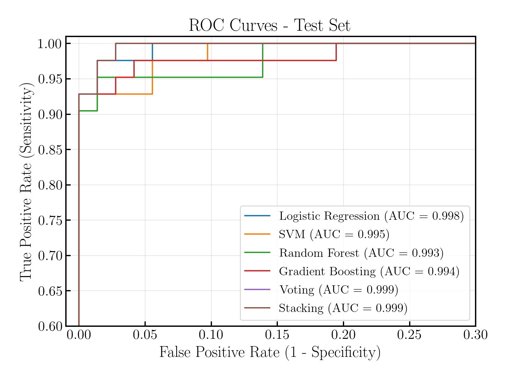
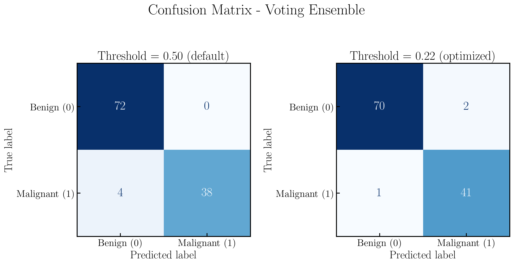
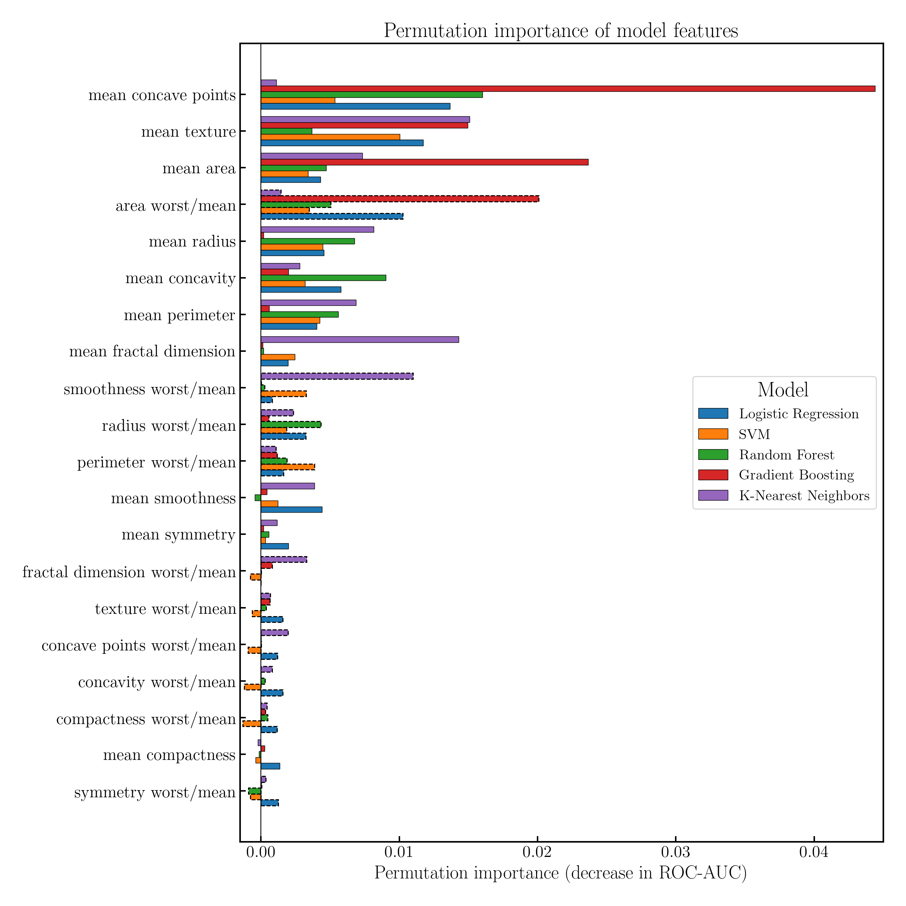

# Breast Cancer Classification: Model Comparison and Diagnostic Metrics

A supervised machine-learning project using the **Wisconsin Diagnostic Breast Cancer dataset** to compare classification models, with particular emphasis on diagnostic metrics such as sensitivity (recall), specificity, F1-score, and ROC-AUC.

The project also explores a small amount of feature engineering and compares individual classifiers with soft voting and stacking ensembles.

## Deployment

The final model is packaged as a reproducible application rather than remaining notebook-only. A shared feature pipeline keeps training and inference transformations identical, while a separately calibrated decision threshold is loaded alongside the trained model. The prediction module is served through a FastAPI application with health and prediction endpoints, and the complete service can be built and run with Docker.

## Overview

The dataset contains measurements derived from digitized images of breast-mass fine-needle aspirates. The original dataset provides 30 numerical features for each observation:

- 10 mean measurements
- 10 measurement-error features
- 10 "worst" measurements

The target is encoded here as:

- `0` — benign
- `1` — malignant

The main analysis uses 20 features:

- the 10 mean measurements
- 10 ratios of `worst / mean`

The ratio representation was selected after comparing several feature groups with a Random Forest classifier.

## Workflow

The notebook follows this progression:

1. **Data inspection and exploratory analysis**
   - Class distribution
   - Feature distributions and pairplots
   - Feature correlation matrix

2. **Feature engineering and representation selection**
   - Mean features
   - Error features
   - Worst features
   - Relative `worst / mean` features
   - Comparison using stratified 5-fold cross-validation on training data

3. **Model comparison**
   - Logistic Regression
   - Support Vector Machine (RBF kernel)
   - Random Forest
   - Gradient Boosting
   - K-Nearest Neighbors

4. **Hyperparameter tuning**
   - Grid search using ROC-AUC as the optimization metric
   - Stratified 5-fold cross-validation using only the training split

5. **Model evaluation**
   - Fit selected models on the complete training split
   - Plot threshold-independent ROC curves on the test probabilities
   - Select model-specific classification thresholds using training out-of-fold probabilities
   - Evaluate once on the untouched 20% test split
   - Accuracy, recall / sensitivity, specificity, F1-score, and ROC-AUC at the selected thresholds
   - Confusion-matrix comparison at the default and optimized Voting thresholds

6. **Model interpretation**
   - Permutation importance based on ROC-AUC
   - Comparison of feature importance across models

7. **Ensemble models**
   - Weighted soft voting
   - Stacking

## Results

### Feature engineering

A bounded feature-engineering experiment compared several representations.

The main finding was that the absolute error measurements added little predictive value in the Random Forest experiment, whereas the `worst / mean` ratios provided useful additional information.

The ratio construction handles zero means explicitly. In the dataset, the zero-concavity cases also have zero worst concavity, so their ratio is set to zero.


### Threshold interpretation

The classification threshold controls the trade-off between false negatives and false positives. Lowering it generally increases sensitivity by classifying more observations as malignant, but may reduce specificity. In this analysis, thresholds were selected separately for each model using training out-of-fold probabilities; the test set was not used to choose them. The trade-off can be understood from the ROC curves:



The table below reports the final evaluation on the untouched 20% test split using thresholds selected from training out-of-fold probabilities. These are single-split estimates, not cross-validation averages. The threshold search maximizes sensitivity while requiring at least 90% specificity on the training folds. The training cross-validation results are used for model comparison, hyperparameter selection, and threshold selection; the test set is used only for final evaluation and diagnostic plots.

| Model | Threshold | Accuracy | Recall | Specificity | F1 | ROC-AUC |
|---|---:|---:|---:|---:|---:|---:|
| Logistic Regression | 0.135 | 95.6% | 100.0% | 93.1% | 94.4% | 99.8% |
| SVM | 0.145 | 93.9% | 100.0% | 90.3% | 92.3% | 99.5% |
| Random Forest | 0.260 | 95.6% | 95.2% | 95.8% | 94.1% | 99.3% |
| Gradient Boosting | 0.120 | 95.6% | 95.2% | 95.8% | 94.1% | 99.4% |
| K-Nearest Neighbors | 0.180 | 97.4% | 97.6% | 97.2% | 96.5% | 99.8% |
| **Voting** | 0.220 | 97.4% | 97.6% | 97.2% | 96.5% | **99.9%** |
| **Stacking** | 0.095 | 97.4% | 100.0% | 95.8% | 96.6% | **99.9%** |

The positive class is malignant, so recall is sensitivity to malignant cases and specificity measures the correct identification of benign cases. ROC-AUC is threshold-independent; accuracy, recall, specificity, F1-score, and the confusion matrix depend on the selected operating threshold. These differences should not be overinterpreted because the dataset is small and the test set contains only 114 observations.

### Voting confusion-matrix comparison



Lowering the Voting threshold to 0.220 improved sensitivity from 90.5% to 97.6%, while slightly reducing specificity from 100.0% to 97.2% on this test split.


### Permutation importance



Permutation importance was calculated using a held-out split and ROC-AUC as the scoring metric. This provides a common definition of feature importance across models, including models such as SVM for which there is no directly comparable tree-style feature importance.

Because several measurements are strongly correlated, individual permutation importances should not be interpreted as completely independent measures of biological relevance. The analysis is primarily intended to understand how the fitted models use the available feature representation.

## Running the API

The production-style API can be run locally with Docker:

```bash
docker build -t breast-cancer-classifier .
docker run --rm -p 8000:8000 breast-cancer-classifier
```

If Docker reports a permission error, run both commands with `sudo`.

The interactive API documentation is available at [http://127.0.0.1:8000/docs](http://127.0.0.1:8000/docs). The health endpoint is available at [http://127.0.0.1:8000/health](http://127.0.0.1:8000/health).

The `POST /predict` endpoint accepts all 30 raw measurements under a `measurements` object. The Swagger documentation includes a complete valid example. The response contains the malignant probability, calibrated threshold, and binary prediction.


## Project structure

```text
breast-cancer-classifier/
├── breast_cancer_classifier_comparison.ipynb
├── features.py
├── train.py
├── calibrate_threshold.py
├── predict.py
├── api/
│   └── app.py
├── tests/
│   └── test_api.py
├── model/
│   ├── model.joblib
│   └── threshold.json
├── figs/
│   ├── confusion_matrix_voting_comparison.png
│   ├── feature_importance.png
│   ├── roc_curves.png
│   └── ...
├── Dockerfile
├── requirements.txt
└── README.md
```

## Main tools

- Python
- NumPy
- pandas
- Matplotlib
- Seaborn
- scikit-learn
- Jupyter
- FastAPI
- Uvicorn
- Docker
- pytest

## Notes and limitations

This is an educational machine-learning project, not a clinical diagnostic system.

The dataset is small, and the observations are not representative of a modern clinical deployment population. The final test estimate is based on one stratified holdout split, so it is itself uncertain. The feature representation, hyperparameters, and thresholds are selected using training data only, but nested cross-validation would be needed for a less optimistic estimate of the complete model-selection procedure.

A clinical deployment would also require external validation, calibration analysis, threshold selection based on clinical costs, and assessment of subgroup performance.

## Dataset

The project uses the Wisconsin Diagnostic Breast Cancer dataset included with scikit-learn via `sklearn.datasets.load_breast_cancer`.
