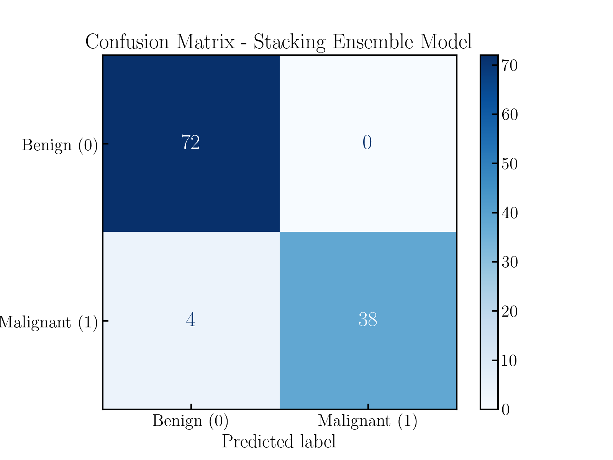

# Breast Cancer Classification: Model Comparison and Diagnostic Metrics

A supervised machine-learning project using the **Wisconsin Diagnostic Breast Cancer dataset** to compare classification models, with particular emphasis on diagnostic metrics such as sensitivity (recall), specificity, F1-score, and ROC-AUC.

The project also explores a small amount of feature engineering and compares individual classifiers with soft voting and stacking ensembles.

## Overview

The dataset contains measurements derived from digitized images of breast-mass fine-needle aspirates. The original dataset provides 30 numerical features for each observation:

- 10 mean measurements
- 10 measurement-error features
- 10 "worst" measurements

The target is encoded here as:

- `0` — benign
- `1` — malignant

The main analysis uses 20 features:

- the 10 mean measurements
- 10 ratios of `worst / mean`

The ratio representation was selected after comparing several feature groups with a Random Forest classifier.

## Workflow

The notebook follows this progression:

1. **Data inspection and exploratory analysis**
   - Class distribution
   - Feature distributions and pairplots
   - Feature correlation matrix

2. **Feature engineering**
   - Mean features
   - Error features
   - Worst features
   - Relative `worst / mean` features
   - Comparison using stratified 5-fold cross-validation

3. **Model comparison**
   - Logistic Regression
   - Support Vector Machine (RBF kernel)
   - Random Forest
   - Gradient Boosting
   - K-Nearest Neighbors

4. **Hyperparameter tuning**
   - Grid search using F1-score as the optimization metric
   - Stratified 5-fold cross-validation

5. **Model evaluation**
   - Accuracy
   - Recall / sensitivity
   - Specificity
   - ROC-AUC
   - Confusion matrix

6. **Model interpretation**
   - Permutation importance based on ROC-AUC
   - Comparison of feature importance across models

7. **Ensemble models**
   - Weighted soft voting
   - Stacking

## Results

The final cross-validated comparison obtained the following results:

| Model | Accuracy | Recall | Specificity | ROC-AUC |
|---|---:|---:|---:|---:|
| Logistic Regression | 97.7 ± 0.9% | 95.8 ± 3.7% | 98.9 ± 1.6% | 99.4 ± 0.7% |
| SVM | **98.1 ± 1.2%** | 94.8 ± 3.1% | **100.0 ± 0.0%** | **99.6 ± 0.5%** |
| Random Forest | 96.3 ± 1.5% | 95.3 ± 3.4% | 96.9 ± 2.0% | 99.3 ± 0.6% |
| Gradient Boosting | 97.7 ± 1.6% | 95.8 ± 3.4% | 98.9 ± 2.2% | 99.5 ± 0.7% |
| K-Nearest Neighbors | 96.1 ± 1.8% | 90.6 ± 4.2% | 99.4 ± 0.7% | 97.2 ± 2.0% |
| Voting | 98.1 ± 0.9% | 95.3 ± 3.0% | 99.7 ± 0.6% | 99.5 ± 0.5% |
| Stacking | **98.2 ± 1.2%** | **96.3 ± 3.2%** | 99.4 ± 0.7% | 99.5 ± 0.5% |

The differences between the strongest models are small. In particular, the ensemble methods do not produce a dramatic improvement over the individual classifiers. Stacking gives the highest mean accuracy and recall in this experiment, while the SVM gives the highest ROC-AUC and specificity.

These results should be interpreted as cross-validated model-selection results rather than as an independent estimate of deployment performance.

## Feature engineering

A bounded feature-engineering experiment compared several representations.

The main finding was that the absolute error measurements added little predictive value in the Random Forest experiment, whereas the `worst / mean` ratios provided useful additional information.

The final representation therefore contains:

```text
mean radius
mean texture
...
mean fractal dimension

radius worst/mean
texture worst/mean
...
fractal dimension worst/mean
```

The ratio construction handles zero means explicitly. In the dataset, the zero-concavity cases also have zero worst concavity, so their ratio is set to zero.

## Interpretation

Permutation importance was calculated using a held-out split and ROC-AUC as the scoring metric. This provides a common definition of feature importance across models, including models such as SVM for which there is no directly comparable tree-style feature importance.

Because several measurements are strongly correlated, individual permutation importances should not be interpreted as completely independent measures of biological relevance. The analysis is primarily intended to understand how the fitted models use the available feature representation.

## Figures

Suggested repository figures:

### Confusion matrix



### Permutation importance


For the final repository version, it would also be useful to add a compact model-comparison figure showing the main metrics side by side.

## Project structure

```text
breast-cancer-classifier/
├── breast_cancer_classifier_comparison.ipynb
├── figs/
│   ├── confusion_matrix.png
│   ├── feature_importance.png
│   └── ...
└── README.md
```

## Main tools

- Python
- NumPy
- pandas
- Matplotlib
- Seaborn
- scikit-learn
- Jupyter

## Notes and limitations

This is an educational machine-learning project, not a clinical diagnostic system.

The dataset is small, and the observations are not representative of a modern clinical deployment population. In addition, model selection and subsequent cross-validation in the current notebook use the same dataset, so the reported cross-validated values should not be treated as a completely unbiased final generalization estimate.

A stronger final evaluation would reserve an untouched test set **before** feature selection and hyperparameter tuning, or use nested cross-validation.

## Dataset

The project uses the Wisconsin Diagnostic Breast Cancer dataset included with scikit-learn via `sklearn.datasets.load_breast_cancer`.
